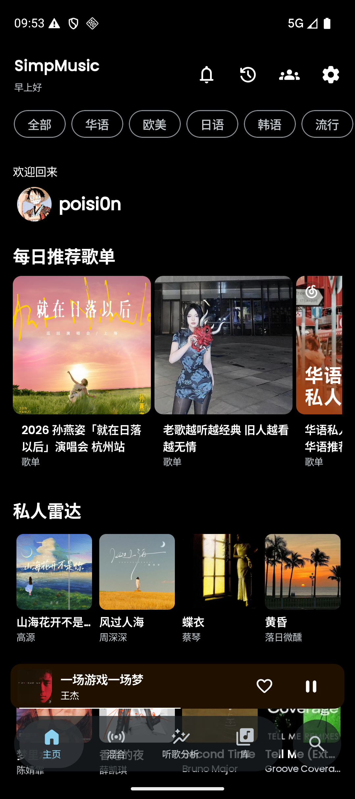
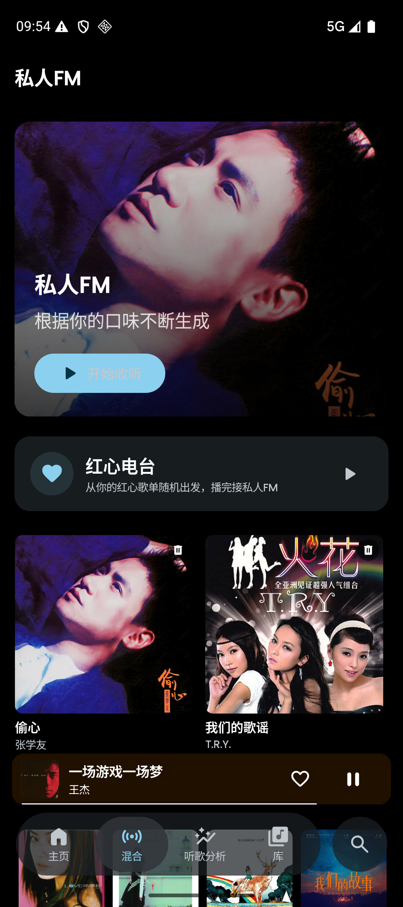
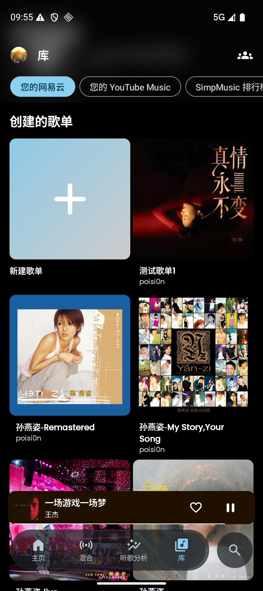
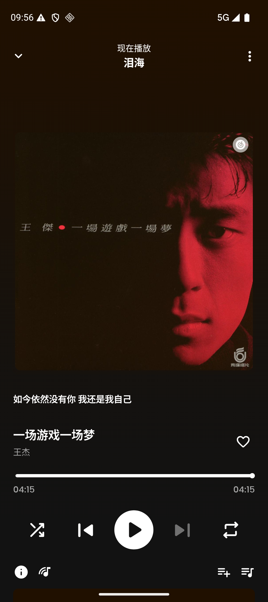
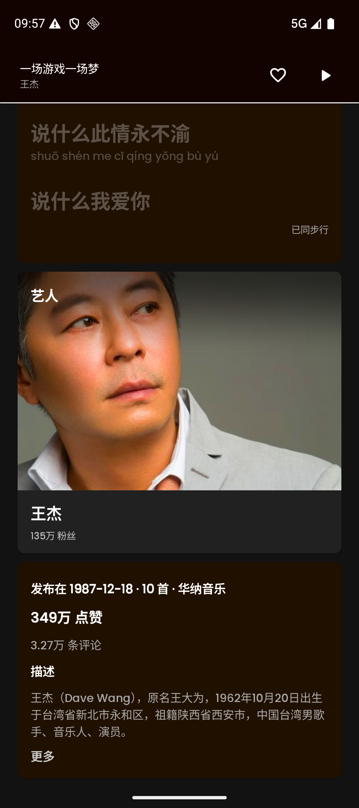
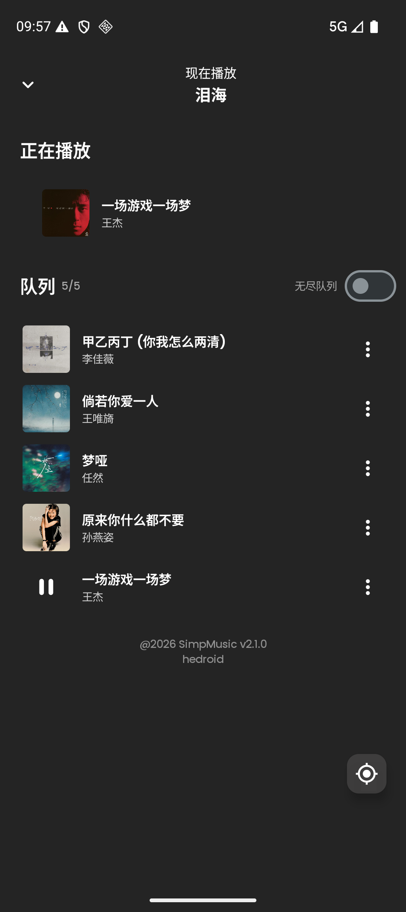
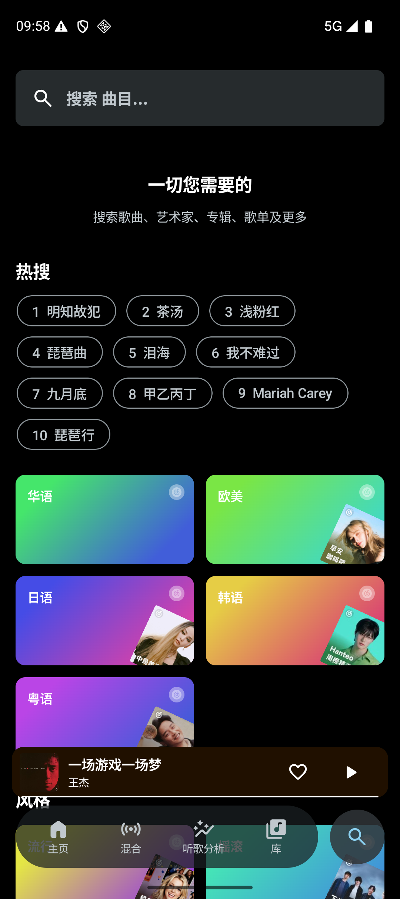
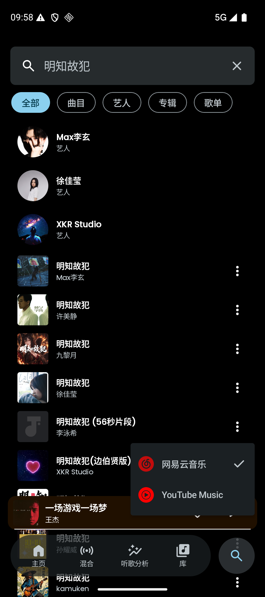
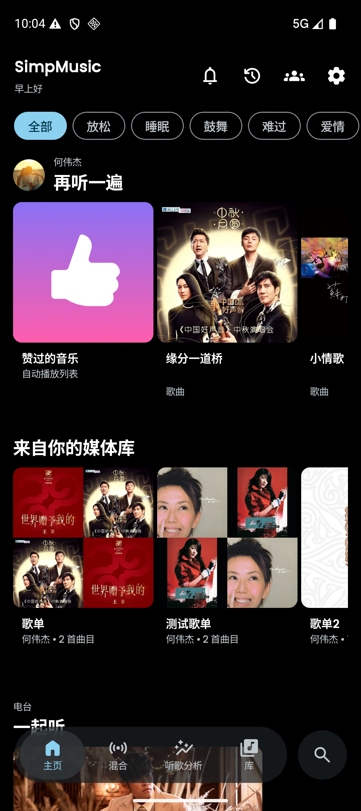

<div align="center">


<h1>SimpMusic 双源版</h1>

一个 FOSS 的双音源音乐客户端：在 [SimpMusic](https://github.com/maxrave-dev/SimpMusic)（YouTube Music）的基础上，
完整接入了 **网易云音乐** 音源，并做了大量播放稳定性、性能与本地体验优化。

<a href="https://github.com/maxrave-dev/SimpMusic"></a>
<a href="https://github.com/hedroid/SimpMusic"></a>
<a href="https://github.com/hedroid/NeriPlayer"></a>

</div>

> **相关项目**
> - 上游原版 SimpMusic（YouTube Music 客户端本体）：**https://github.com/maxrave-dev/SimpMusic**
> - 本 fork：**https://github.com/hedroid/SimpMusic**（core 子模块在 [hedroid/SimpMusic-Core](https://github.com/hedroid/SimpMusic-Core)）
> - 姊妹项目 NeriPlayer（同作者的另一款音乐播放器，多源流媒体 + 本地管理 + 自建同步）：**https://github.com/hedroid/NeriPlayer**
>   本 fork 的播放错误恢复、物理洗牌等多处设计参考了它的实现。

## 截图

<p align="center">



</p>
<p align="center">
<sub>网易云音乐主页（每日推荐 / 私人雷达） · 混合页（私人 FM / 红心电台-心动模式） · 资料库「您的网易云」三分区</sub>
</p>

<p align="center">



</p>
<p align="center">
<sub>播放页（经典主题） · 歌词 + 网易详情卡（粉丝 / 点赞 / 评论 / 专辑简介 / 罗马音） · 队列（计数 / 定位 / 无尽队列）</sub>
</p>

<p align="center">



</p>
<p align="center">
<sub>网易搜索（热搜榜） · 长按搜索按钮切换音源（切源不打断播放） · YouTube Music 主页（双源并存）</sub>
</p>

## 与上游的核心差异

### 🎵 网易云音乐音源（本 fork 最大的增量）

- **双音源并存**：长按底栏搜索按钮随时切换 YouTube Music / 网易云音乐；切源只切数据源，
  **不打断正在播放的音乐**（播放管线按歌曲 ID 形状路由，混源队列也能连续播放）。
- **完整浏览链路**：网易主页（每日推荐 / 私人雷达 / 分类歌单）、搜索（热搜榜 + 歌曲/专辑/歌手/歌单分 tab、无限滚动）、
  歌单 / 专辑 / 歌手详情页、分类页、排行榜、艺人「全部歌曲」页（热门 / 最新排序）、「相似歌曲」独立页。
- **私人 FM 与红心电台**：红心电台走官方「心动模式」接口（红心歌单个性化推荐），FM 播完自动接续。
- **歌词专线**：直接使用网易官方歌词（原文 / 人工翻译 / 官方罗马音），翻译质量优于 AI 翻译且不消耗 AI 配额。
- **收藏全面云端化**：红心 / 收藏歌单专辑 / 关注艺人都是云端账号状态，一处操作全端同步；未登录时按钮置灰引导登录。
- **灰歌处理**：无版权 / VIP 专属歌曲在列表中置灰显示，播放失败时按设置三档动作：自动跳过 / 暂停 /
  **自动匹配 YouTube Music 同名曲替换播放**（标题 + 艺人 + 时长择优，含防循环护栏）。
- **高音质**：网易 320k / 无损 FLAC 流播放，支持导出音频文件（FLAC/MP3 + 封面）到系统下载目录。
- **无尽队列与电台**：网易普通队列可开启无尽续播（播完自动续相似歌），电台按尾曲续批；
  队列页有「当前第几首」计数与浮动定位按钮。
- **本地歌单同步上云**：本地歌单一键同步为网易云端歌单（增量同步），也可以在 app 内新建 / 管理 / 删除云端歌单，
  所有云端写操作成功后**本地即时回写**（事件总线 + 乐观更新，无需手动刷新）。
- **多选批量操作**：列表多选后批量点赞、批量添加到歌单、批量下载（双源各自执行，含未登录 / 混源门控提示）。

### ⚡ 播放稳定性与性能优化

- **真机发热修复**：列表「正在播放」Lottie 指示条曾以 120Hz 持续重绘（静止页面仍 120+fps、主线程 50%+ 占用），
  现限帧至 12fps，实测帧率 122fps → 8-13fps；另有 marquee 连滚修复。
- **播放错误恢复重构**（参考 NeriPlayer）：重试尊重暂停意图、加载完成尊重中途暂停、ERROR 态按播放键原地重载、
  音频焦点交互计数防「暂停的歌自己复活」、取流失败退避重试。
- **长音频静音 bug 修复**：分块截断导致 320k/FLAC 大文件只解码前段就静音，现网络流完整装载。
- **封面与视觉**：播放页 / 详情页封面按 1080px 请求（原先被钉在 544px 导致模糊）；切歌封面零闪烁
  （pager 按页数据驱动）；歌词 stale-while-revalidate，切歌不再闪空。
- **数字紧凑格式**：粉丝 / 播放 / 点赞等计数按语言习惯显示（中文万进制「17.5 万」，其它 K/M/B）。

### 🎨 UI / UX 细节

- 队列页计数 + 浮动定位按钮（两种主题视图一致）。
- **物理洗牌**：随机播放 = 队列物理重排（网易官方同款语义），通知栏随机按钮两态图标。
- 触感反馈全局三档可调（含播放页 sheet、迷你条拉断切歌、封面翻页震感）。
- Apple Music 主题横屏侧栏（35% 宽面板）compact 适配。
- 下拉刷新静默化，指示器仅作「手势已受理」确认（≤600ms），不再陪跑全部网络请求。
- 云端写操作失败有专属文案（如网易频控 405 专属提示，批量操作遇频控立即停止防止续期风控窗口）。

### 🔇 相对上游隐藏 / 下线的功能

出于「双源云端化」的设计取舍，部分上游功能在本 fork 中被隐藏或下线（本地歌单入口改为云端歌单、
Discord 集成、导入播放列表等），完整清单与恢复方法见 [docs/HIDDEN_FEATURES.md](docs/HIDDEN_FEATURES.md)。

## 构建

```bash
git clone --recurse-submodules https://github.com/hedroid/SimpMusic.git
cd SimpMusic
./gradlew :composeApp:assembleDebug
```

- Android 端为主要适配与验证平台（`com.maxrave.simpmusic.dev` 为 debug 包名）；桌面端沿用上游能力，网易源未做专门验证。
- core 子模块：[hedroid/SimpMusic-Core](https://github.com/hedroid/SimpMusic-Core)（fork 自 [maxrave-dev/core](https://github.com/maxrave-dev/core)）。

## 致谢

- **[maxrave-dev/SimpMusic](https://github.com/maxrave-dev/SimpMusic)** — 上游原版，本项目的基础。绝大部分功能（三主题播放页、
  SponsorBlock / Return YouTube Dislike、均衡器、Listen Together、桌面端等）由上游提供，请给上游一个 ⭐。
- [InnerTune](https://github.com/z-huang/InnerTune/) / [SmartTube](https://github.com/yuliskov/SmartTube) — 上游获取 YouTube Music 数据与流媒体的思路来源。
- [SponsorBlock](https://sponsor.ajay.app/) / Return YouTube Dislike / [LRCLIB](https://lrclib.net/) — 数据服务。
- [NeriPlayer](https://github.com/hedroid/NeriPlayer) — 播放稳定性与队列设计的参考实现。
- 网易云音乐数据来自其公开 Web 接口，本应用仅作个人学习与自用客户端。

## 法律声明

本项目延续上游立场：仅供教育与个人使用的开源项目，不含任何商业行为；应用本身不托管、不上传、不分发任何音频或
版权内容，所有流媒体内容分别来自 YouTube / YouTube Music 与网易云音乐的公开服务并归其版权方所有。请支持你喜欢的
音乐人与平台（如订阅 [YouTube Premium](https://www.youtube.com/premium) 或网易云音乐会员）。使用者须自行确保使用方式
符合当地法律与相关平台的服务条款。

本项目按上游相同许可发布，详见 [LICENSE](LICENSE)。
